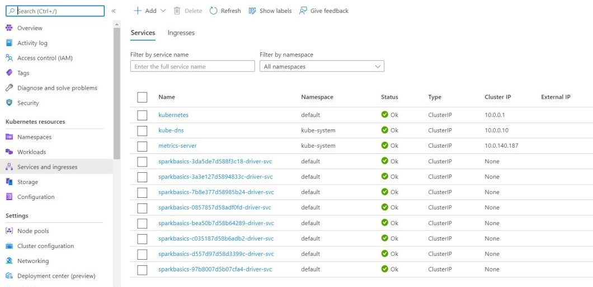

path: https://github.com/Andrey-Vospr/M06_SparkBasics_PYTHON_AZURE

# 🚀 Spark Basics Homework Project

This project demonstrates a complete Spark ETL pipeline deployed on Azure Kubernetes Service (AKS), covering infrastructure provisioning, data enrichment, and distributed Spark processing.

---

## 🛠️ Prerequisites

Before starting, make sure the following tools are installed and configured:

- **Rancher Desktop** – Required for running Kubernetes locally (alternative to Docker Desktop).
- **Java** – Java 11 recommended.
- **Maven (mvn)** – Used to build the Java-based Spark application.
- **Spark** – Required to run jobs using `spark-submit`.
- **Terraform** – For provisioning Azure infrastructure.
- **Azure CLI** – For managing Azure services and resources.
- **dos2unix** – Converts Windows-style (CRLF) to Unix (LF) line endings.

---

## 📌 Project Flow

### 1. 🔐 Create a Storage Account for Terraform State

Use Azure CLI or Portal to create a Storage Account and Blob Container for Terraform backend state.


---

### 2. 🏗️ Deploy Infrastructure with Terraform

```bash
terraform init
terraform plan -out terraform.plan
terraform apply terraform.plan
```

This will provision the AKS cluster, ACR, and supporting Azure infrastructure.


---

### 3. 🧱 Configure and Use Azure Container Registry (ACR)

Push your custom Spark Docker image to ACR.


---

### 4. 🗂️ Upload Hotel and Weather Data to Azure Blob Storage


---

### 5. 🛠️ Set Up Local Project and Maven Build

Build your project using Maven before submitting it to the cluster.

```bash
mvn clean package
```

---

### 6. 🔑 Retrieve `kubeconfig.yaml` and Set It as Default

```bash
az aks get-credentials --resource-group your-rg --name your-aks
```


---

### 7. 🐳 Build and Push Docker Image

```bash
docker build -t your-image-name .
docker tag your-image-name <acr-login-server>/your-image-name
docker push <acr-login-server>/your-image-name
```


---

### 8. ☁️ Launch Spark Application in Cluster Mode on AKS

Submit the job using `spark-submit` with your Kubernetes configuration and image.



---

## 🔄 ETL Workflow

1. **Load Hotel & Weather Datasets**
   ```java
   Dataset<Row> hotels = repo.readCSV(properties.getProperty("input.path.hotels"));
   Dataset<Row> weather = repo.readParquet(properties.getProperty("input.path.weather"));
   ```

2. **Enrich Hotel Data with Missing Coordinates**
   ```java
   Dataset<Row> enrichedHotels = geoService.enrichWithGeohash(hotels);
   ```

3. **Add Geohash to Both Datasets**
   ```java
   hotelDs.withColumn("geohash", callUDF("geohashUDF", col("latitude").cast(DoubleType), col("longitude").cast(DoubleType)));

   weatherDs.withColumn("geohash", callUDF("geohashUDF", col("lat"), col("lng")))
            .dropDuplicates("year", "month", "day", "geohash");
   ```

4. **Join Datasets by Geohash**
   ```java
   weatherDs.join(hotelsDs, hotelsDs.col("geohash").equalTo(weatherDs.col("geohash")), "inner")
            .drop(hotelsDs.col("geohash"))
            .drop(hotelsDs.col("Latitude"))
            .drop(hotelsDs.col("Longitude"));
   ```

5. **Write Result to Parquet (Partitioned by Year/Month/Day)**
   ```java
   repo.writeParquet(joined, properties.getProperty("output.path.result"), "year", "month", "day");
   ```

---


---

## 👤 Author

**Popov Andrey**  
_MSc Student · University of Neuchâtel_  
_Azure for Students Program_